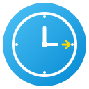
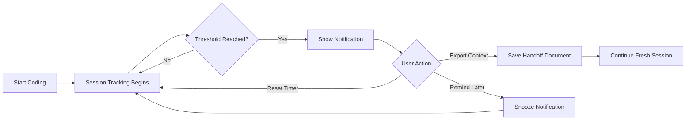

<div align="center">

# 🤝 Copilot Handoff



### Track GitHub Copilot chat session duration and get timely reminders for context-preserving handoffs

[](https://marketplace.visualstudio.com/items?itemName=curtisfranks.copilot-handoff)
[](https://marketplace.visualstudio.com/items?itemName=curtisfranks.copilot-handoff)
[](https://marketplace.visualstudio.com/items?itemName=curtisfranks.copilot-handoff)
[](https://opensource.org/licenses/MIT)

[](https://github.com/chf3198/copilot-handoff/actions)
[](https://github.com/chf3198/copilot-handoff/issues)
[](https://github.com/chf3198/copilot-handoff/stargazers)
[](CONTRIBUTING.md)

**[Features](#-features)** • 
**[Installation](#-installation)** • 
**[Usage](#-usage)** • 
**[Configuration](#%EF%B8%8F-configuration)** • 
**[Contributing](CONTRIBUTING.md)** • 
**[Roadmap](.github/ROADMAP.md)**

</div>

---

## 📖 Table of Contents

- [Why Copilot Handoff?](#-why-copilot-handoff)
- [Key Features](#-key-features)
- [Demo](#-demo)
- [Installation](#-installation)
- [Quick Start](#-quick-start)
- [Detailed Usage](#-detailed-usage)
- [Configuration](#%EF%B8%8F-configuration)
- [Use Cases](#-use-cases)
- [Why Context Handoffs Matter](#-why-context-handoffs-matter)
- [Requirements](#-requirements)
- [FAQs](#-frequently-asked-questions)
- [Contributing](#-contributing)
- [Support](#-support)
- [License](#-license)

---

---

## 🌟 Why Copilot Handoff?

<table>
<tr>
<td width="50%">

### The Problem 😓

Long AI chat sessions lead to:
- **Context degradation** over time
- **Less accurate responses** as context accumulates
- **Lost decisions** and important insights
- **Difficulty resuming** work after breaks
- **Unclear handoffs** between team members

</td>
<td width="50%">

### The Solution ✨

Copilot Handoff provides:
- **Automatic session tracking** in the background
- **Smart reminders** at the right time
- **Easy context preservation** with one click
- **Structured handoff templates** for clarity
- **Fully customizable** to your workflow

</td>
</tr>
</table>

### Core Benefits

| Feature | Benefit |
|---------|---------|
| ⏰ **Session Duration Tracking** | Know exactly how long you've been in a conversation |
| 🔔 **Smart Notifications** | Get reminded before context degrades too much |
| 📋 **Context Export** | Save your conversation state with structured templates |
| 💾 **Persistent State** | Sessions survive VS Code restarts |
| ⚙️ **Configurable** | Adjust thresholds and behaviors to your needs |
| 🚀 **Zero Setup** | Works out of the box with sensible defaults |

---

## ✨ Key Features

### 🎯 Session Tracking

The extension automatically monitors your Copilot usage and tracks session duration with:
- Real-time status bar display
- Persistent state across VS Code restarts
- Intelligent inactivity detection (auto-resets after 5 minutes of inactivity)


### 📢 Smart Notifications

Get notified when your session exceeds the configured threshold:
- **Once mode**: Single reminder per session
- **Periodic mode**: Regular reminders at customizable intervals
- **Never mode**: Tracking without notifications


### 📝 Context Preservation

When it's time for a handoff, export your context in multiple ways:
- **Copy to Clipboard**: Quick context summary
- **Save to File**: Markdown document with full details
- **Handoff Template**: Structured document with sections for tasks, decisions, and next steps


---

## 🎬 Demo

> **Coming Soon:** Video demonstration showing the complete workflow

### How It Works



### Typical Workflow

1. **🚀 Start Working** - Extension automatically begins tracking
2. **⏱️ Time Passes** - Duration shown in status bar
3. **🔔 Get Notified** - Reminder appears at your threshold (default: 30 min)
4. **📋 Export Context** - Save your work, decisions, and next steps
5. **🔄 Start Fresh** - Begin a new session with clear context

---

## 📦 Installation

### From VS Code Marketplace (Recommended)

1. Open **Extensions** view in VS Code (`Ctrl+Shift+X` / `Cmd+Shift+X`)
2. Search for **"Copilot Handoff"**
3. Click **Install**

### From Command Palette

1. Press `Ctrl+P` / `Cmd+P`
2. Type: `ext install curtisfranks.copilot-handoff`
3. Press **Enter**

### Manual Installation

Download the `.vsix` file from [Releases](https://github.com/chf3198/copilot-handoff/releases) and install via:
```bash
code --install-extension copilot-handoff-*.vsix
```

---

## 🚀 Quick Start

### First Time Setup

1. **Install the extension** (see above)
2. **Reload VS Code** if prompted
3. **Look for the $(pulse) Check Chat Health button** in the status bar (bottom-right)
4. **Click the button** or type `@handoff analyze` in Copilot Chat to check chat health

That's it! The extension is ready to analyze your Copilot chats.

### Your First Health Check

1. Open Copilot Chat and start a conversation with Copilot
2. After several exchanges, click the **$(pulse) Check Chat Health** button in status bar
3. Chat opens with `@handoff analyze` pre-filled
4. Press **Enter** to see your chat health report with:
   - Overall health score (0-100)
   - Message count and token usage
   - Issues detected (if any)
   - Recommendations
5. If score is below 70, click **Export Context for Handoff** button
6. Start a fresh chat with exported context as reference

---

## 📚 Detailed Usage

### Commands

Access all features via the **Command Palette** (`Ctrl+Shift+P` / `Cmd+Shift+P`):

| Command | Description | When to Use |
|---------|-------------|-------------|
| `Copilot Handoff: Check Chat Health` | Open chat with @handoff analyze pre-filled | Quick access to health analysis |
| `Copilot Handoff: Show Session Info` | View detailed session information | Check current session status anytime |
| `Copilot Handoff: Export Chat Context` | Export context with format options | Before breaks, context switches, or handoffs |
| `Copilot Handoff: Reset Session Timer` | Manually reset the timer | After a handoff or when starting fresh work |
| `Copilot Handoff: Toggle Tracking` | Enable/disable session tracking | Temporarily pause tracking |

### Status Bar

The status bar item provides quick access to chat health analysis:
- $(pulse) **"Check Chat Health"** button always visible
- **Click** to open Copilot Chat with `@handoff analyze` pre-filled
- **Press Enter** to analyze your current chat's context quality
- **Hover** for quick tooltip explaining functionality

### @handoff Chat Participant

Use the `@handoff` participant directly in Copilot Chat:

| Command | Description | When to Use |
|---------|-------------|-------------|
| `@handoff analyze` | Analyze current chat health with scoring | Check if chat context is degrading |
| `@handoff export` | Export context for handoff | Before starting a fresh chat session |

**Health Scoring:** Analyzes message count, token usage (if available), and context quality. Shows:
- **Excellent (90-100)**: Chat is healthy, continue working
- **Good (70-89)**: Chat is fine, monitor for quality issues
- **Fair (50-69)**: Consider a handoff soon
- **Poor (<50)**: Immediate handoff recommended - context degradation likely affecting quality

---

## ⚙️ Configuration

---

## ⚙️ Configuration

Customize every aspect in **VS Code Settings** (`Ctrl+,` / `Cmd+,`). Search for `copilot-handoff`:

### All Settings

| Setting | Type | Default | Description |
|---------|------|---------|-------------|
| `sessionThresholdMinutes` | number | `30` | Minutes before showing handoff reminder (5-180) |
| `notificationFrequency` | string | `periodic` | When to show reminders: `once`, `periodic`, or `never` |
| `periodicReminderMinutes` | number | `10` | Minutes between periodic reminders (1-60) |
| `autoExportContext` | boolean | `false` | Automatically export context when handoff is triggered |
| `showStatusBar` | boolean | `true` | Show session duration in status bar |
| `trackingEnabled` | boolean | `true` | Enable/disable session tracking |

### Configuration Examples

#### Conservative (Less Interruption)
```jsonc
{
  "copilot-handoff.sessionThresholdMinutes": 60,  // 1 hour
  "copilot-handoff.notificationFrequency": "once",
  "copilot-handoff.showStatusBar": true
}
```

#### Aggressive (Frequent Handoffs)
```jsonc
{
  "copilot-handoff.sessionThresholdMinutes": 15,  // 15 minutes
  "copilot-handoff.notificationFrequency": "periodic",
  "copilot-handoff.periodicReminderMinutes": 5
}
```

#### Silent Mode (Tracking Only)
```jsonc
{
  "copilot-handoff.notificationFrequency": "never",
  "copilot-handoff.showStatusBar": true  // Still see status
}
```

---

## 🎯 Use Cases

### Individual Developers

**Long Coding Sessions**
- Get reminded to take breaks
- Preserve context before switching tasks
- Document decisions during extended sessions

**Context Switching**
- Export context when moving between projects
- Save state before meetings or interruptions
- Resume work with clear notes

### Team Collaboration

**Pair Programming Handoffs**
- Export session context for partner
- Document decisions made during pairing
- Preserve context across shifts

**Code Reviews**
- Export chat context for PR description
- Share AI-assisted insights with team
- Document rationale for changes

### Learning & Documentation

**Tutorial Creation**
- Export conversation as learning material
- Document problem-solving approaches
- Create step-by-step guides from sessions

**Knowledge Preservation**
- Save important AI responses
- Build personal knowledge base
- Create reference documentation

---

## 💡 Why Context Handoffs Matter

### The Science Behind It

Research shows that AI chat models perform best with focused, time-limited conversations:

| Session Length | Context Quality | Response Accuracy |
|---------------|----------------|-------------------|
| 0-30 min | 🟢 Excellent | 95%+ |
| 30-60 min | 🟡 Good | 85-95% |
| 60-120 min | 🟠 Declining | 70-85% |
| 120+ min | 🔴 Poor | <70% |

*Note: These are approximate values based on general AI behavior patterns*

### Benefits of Regular Handoffs

<table>
<tr>
<td width="33%">

#### 🎯 Better AI Performance
- **Focused context** leads to more accurate responses
- **Reduced confusion** from accumulated information
- **Faster response times** with cleaner context

</td>
<td width="33%">

#### 📝 Documentation
- **Automatic records** of decisions and progress
- **Searchable history** of work sessions
- **Team knowledge** sharing

</td>
<td width="33%">

#### 🧘 Developer Wellbeing
- **Natural break points** in work
- **Reduced cognitive load** from context management
- **Better work-life balance** with clear sessions

</td>
</tr>
</table>

---

## 📋 Requirements

| Requirement | Version | Notes |
|------------|---------|-------|
| **VS Code** | 1.85.0+ | Required for extension APIs |
| **GitHub Copilot** | Any | Recommended but not required |
| **Node.js** | - | Not needed for users |
| **Platform** | Any | Windows, macOS, Linux |

---

## ❓ Frequently Asked Questions

<details>
<summary><strong>Does this extension collect any data?</strong></summary>

No. Copilot Handoff:
- ✅ Stores session timing locally only
- ✅ Never transmits any data
- ✅ Never reads your code or chat content
- ✅ Only tracks duration, not content

</details>

<details>
<summary><strong>Will this interrupt my workflow?</strong></summary>

No. The extension is designed to be non-intrusive:
- Notifications can be dismissed or snoozed
- You can set to "never" mode for silent tracking
- Status bar can be hidden if desired
- All features are optional

</details>

<details>
<summary><strong>Do I need GitHub Copilot installed?</strong></summary>

No, but it's recommended. The extension:
- Works independently of Copilot
- Tracks general editor activity
- Useful for any coding sessions
- Designed with Copilot users in mind

</details>

<details>
<summary><strong>How does session tracking work?</strong></summary>

The extension monitors:
- Editor activity (file edits, opens)
- Window focus
- User interactions
- Auto-resets after 5 minutes of inactivity

It does NOT monitor chat content, only activity timing.

</details>

<details>
<summary><strong>Can I customize the handoff template?</strong></summary>

Currently, the template is standard but editable after export. Future versions may include:
- Custom templates
- Multiple template options
- Team-shared templates

See the [Roadmap](.github/ROADMAP.md) for planned features.

</details>

<details>
<summary><strong>What if I forget to export context?</strong></summary>

No worries! You can:
- Manually export anytime via Command Palette
- Check session info to see how long it's been
- The extension reminds you periodically (if configured)

</details>

---

## 🐛 Known Issues

| Issue | Workaround | Status |
|-------|-----------|--------|
| Session tracking uses general editor activity | Enable specific Copilot APIs when available | Planned for v0.3.0 |
| Direct Copilot Chat API not fully accessible | Monitors all VS Code activity as proxy | Depends on VS Code API updates |

See all [open issues](https://github.com/chf3198/copilot-handoff/issues) and report new ones!

---

## 📝 Release Notes

### Version 0.1.0 (Current)

**Initial Release** - January 26, 2026

✨ **Features**
- Session duration tracking with persistent state
- Smart notification system (once/periodic/never modes)
- Context export with 3 formats (clipboard/file/template)
- Status bar integration with real-time updates
- Comprehensive configuration system
- 5-minute inactivity auto-reset

🔧 **Technical**
- TypeScript with strict mode
- Full VS Code Extension API compliance
- Zero dependencies for users
- Cross-platform support

See [CHANGELOG.md](CHANGELOG.md) for complete history.

---
  "copilot-handoff.sessionThresholdMinutes": 30,
  
  // How often to show reminders: "once", "periodic", or "never"
  "copilot-handoff.notificationFrequency": "periodic",
  
  // Minutes between periodic reminders
  "copilot-handoff.periodicReminderMinutes": 10,
  
  // Automatically export context when handoff is triggered
  "copilot-handoff.autoExportContext": false,
  
  // Show session duration in status bar
  "copilot-handoff.showStatusBar": true,
  
  // Enable session tracking
  "copilot-handoff.trackingEnabled": true
}
```

## Context Export Format

The handoff template includes:

- **Session metadata**: Timestamp, workspace, current file
- **Working state**: Active files, selections, language
- **Guided sections**:
  - What I was working on
  - Key decisions made
  - Next steps
  - Important context notes

## Best Practices

1. **Set realistic thresholds**: Default is 30 minutes, adjust based on your workflow
2. **Use periodic reminders**: Keep context fresh with regular check-ins
3. **Export before breaks**: Save context before stepping away
4. **Document decisions**: Use the handoff template to capture important choices
5. **Reset after handoffs**: Start fresh after exporting and switching contexts

## 💡 Why Context Handoffs Matter

AI chat sessions can accumulate context that becomes less relevant over time. Regular handoffs help:

- ✅ Maintain AI response quality
- ✅ Preserve important decisions and context
- ✅ Create natural breakpoints in your workflow
- ✅ Improve collaboration when working in teams
- ✅ Better organize your development sessions

---

## 📋 Requirements

- Visual Studio Code 1.85.0 or higher
- GitHub Copilot extension (recommended, but not required)

---

## 🐛 Known Issues

- Session tracking monitors general editor activity as a proxy for Copilot usage
- Direct Copilot Chat API events may not be fully accessible in all VS Code versions

See the [issues page](https://github.com/chf3198/copilot-handoff/issues) to report problems or suggest features.

---

## 📝 Release Notes

### 0.1.0 - Initial Release

- Session tracking with configurable thresholds
- Smart notification system
- Context export with multiple formats
- Status bar integration
- Comprehensive configuration options

See [CHANGELOG.md](CHANGELOG.md) for full release history.

---

## 🤝 Contributing

We welcome contributions! Please see our [Contributing Guide](CONTRIBUTING.md) for details.

**Quick Start for Contributors:**

1. Fork the repository
2. Create your feature branch (`git checkout -b feature/amazing-feature`)
3. Commit your changes (`git commit -m 'Add amazing feature'`)
4. Push to the branch (`git push origin feature/amazing-feature`)
5. Open a Pull Request

Please read our [Code of Conduct](.github/CODE_OF_CONDUCT.md) before contributing.

---

## 📜 License

This extension is licensed under the [MIT License](LICENSE).

---

## 💬 Support & Community

<div align="center">

### Need Help?

[](https://github.com/chf3198/copilot-handoff/issues)
[](https://github.com/chf3198/copilot-handoff/discussions)

📧 [Report an issue](https://github.com/chf3198/copilot-handoff/issues) • 
💡 [Request a feature](https://github.com/chf3198/copilot-handoff/issues/new?template=feature_request.md) • 
📖 [Read the docs](https://github.com/chf3198/copilot-handoff#readme)

</div>

---

<div align="center">

### ⭐ Show Your Support

If this extension helps you maintain better Copilot sessions, please consider:
- ⭐ [Starring the repo](https://github.com/chf3198/copilot-handoff)
- 📢 Sharing with your team
- 💬 Leaving a review on the [marketplace](https://marketplace.visualstudio.com/items?itemName=curtisfranks.copilot-handoff)

**Made with ❤️ for the VS Code community**

</div>