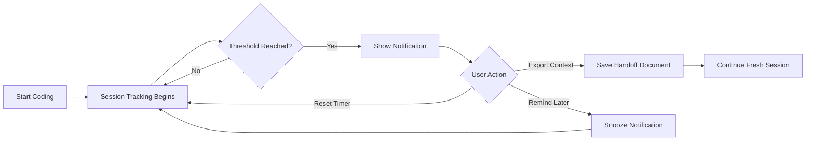

# Copilot Handoff

[](https://marketplace.visualstudio.com/items?itemName=curtisfranks.copilot-handoff)
[](https://marketplace.visualstudio.com/items?itemName=curtisfranks.copilot-handoff)
[](https://marketplace.visualstudio.com/items?itemName=curtisfranks.copilot-handoff)
[](https://github.com/chf3198/copilot-handoff/actions)
[](LICENSE)

**Copilot Handoff** is a VS Code extension that tracks how long you have been in a GitHub Copilot Chat session and reminds you when to start a fresh conversation. Long AI chat sessions degrade context quality — responses become less accurate as the context window fills with older, less relevant information. The extension shows session duration in the status bar, sends configurable reminders at your chosen threshold, and exports a structured handoff document so your next session has full context on what you were working on. Built with TypeScript and the VS Code Extension API.

[Features](#key-features) · [Installation](#installation) · [Usage](#usage) · [Configuration](#configuration) · [Contributing](CONTRIBUTING.md) · [Roadmap](.github/ROADMAP.md)

---

## Why Copilot Handoff?

### The Problem

Long AI chat sessions lead to:
- **Context degradation** over time — the model loses track of earlier decisions
- **Less accurate responses** as irrelevant history accumulates in the context window
- **Lost decisions** and important insights that fall off the edge
- **Difficulty resuming** work after breaks

### The Solution

- **Automatic session tracking** in the background — no manual action needed
- **Smart reminders** at the threshold you choose (default: 30 minutes)
- **Context export** with one click — structured Markdown document or clipboard copy
- **`@handoff` chat participant** for in-chat health analysis and on-demand export

---

## Key Features

| Feature | Description |
|---------|-------------|
| **Session Duration Tracking** | Real-time status bar display. Persists across VS Code restarts. Inactivity auto-reset after 5 minutes. |
| **Smart Notifications** | Configurable reminder modes: once at threshold, periodic at intervals, or never (tracking only). |
| **Context Export** | Save session state as a structured Markdown handoff document, copy to clipboard, or use a guided template with sections for tasks, decisions, and next steps. |
| **@handoff Chat Participant** | `@handoff analyze` scores your chat health (0–100) with recommendations. `@handoff export` exports context to a new session. |
| **Fully Configurable** | Five settings control all thresholds and behaviors. |

---

## How It Works



### Health Scoring

`@handoff analyze` scores your current chat session:

| Score | Status | Recommendation |
|-------|--------|----------------|
| 90–100 | 🟢 Excellent | Chat is healthy — continue working |
| 70–89 | 🟡 Good | Monitor for quality issues |
| 50–69 | 🟠 Fair | Consider a handoff soon |
| < 50 | 🔴 Poor | Immediate handoff recommended |

---

## Installation

**From VS Code Marketplace (recommended)**

1. Open the Extensions view (`Ctrl+Shift+X` / `Cmd+Shift+X`)
2. Search for **"Copilot Handoff"**
3. Click **Install**

**From Command Palette**

Press `Ctrl+P` → type `ext install curtisfranks.copilot-handoff` → Enter

**Manual**

Download the `.vsix` from [Releases](https://github.com/chf3198/copilot-handoff/releases):

```bash
code --install-extension copilot-handoff-*.vsix
```

---

## Usage

### Status Bar

The **$(pulse) Check Chat Health** button is always visible in the status bar. Click it to open Copilot Chat with `@handoff analyze` pre-filled. Press Enter to see your health report.

### Commands

Access all features via the Command Palette (`Ctrl+Shift+P` / `Cmd+Shift+P`):

| Command | Description |
|---------|-------------|
| `Copilot Handoff: Check Chat Health` | Open chat with `@handoff analyze` pre-filled |
| `Copilot Handoff: Show Session Info` | View detailed session information |
| `Copilot Handoff: Export Chat Context` | Export context with format options |
| `Copilot Handoff: Reset Session Timer` | Manually reset the timer |
| `Copilot Handoff: Toggle Tracking` | Enable/disable session tracking |

### @handoff Chat Participant

| Command | Description |
|---------|-------------|
| `@handoff analyze` | Analyze current chat health with 0–100 scoring |
| `@handoff export` | Export context for handoff to a new session |

### Context Export Format

Exported handoff documents include:

- **Session metadata** — timestamp, workspace, current file
- **Working state** — active files, selections, language
- **Guided sections** — what I was working on, key decisions made, next steps, important context notes

---

## Configuration

Customize all settings in VS Code Settings (`Ctrl+,` / `Cmd+,`). Search for `copilot-handoff`:

| Setting | Type | Default | Description |
|---------|------|---------|-------------|
| `sessionThresholdMinutes` | number | `30` | Minutes before showing handoff reminder (5–180) |
| `notificationFrequency` | string | `periodic` | When to show reminders: `once`, `periodic`, or `never` |
| `periodicReminderMinutes` | number | `10` | Minutes between periodic reminders (1–60) |
| `autoExportContext` | boolean | `false` | Automatically export context when handoff triggers |
| `showStatusBar` | boolean | `true` | Show session duration in status bar |
| `trackingEnabled` | boolean | `true` | Enable/disable session tracking |

### Configuration Examples

**Conservative (less interruption)**
```jsonc
{
  "copilot-handoff.sessionThresholdMinutes": 60,
  "copilot-handoff.notificationFrequency": "once",
  "copilot-handoff.showStatusBar": true
}
```

**Aggressive (frequent handoffs)**
```jsonc
{
  "copilot-handoff.sessionThresholdMinutes": 15,
  "copilot-handoff.notificationFrequency": "periodic",
  "copilot-handoff.periodicReminderMinutes": 5
}
```

**Silent (tracking only)**
```jsonc
{
  "copilot-handoff.notificationFrequency": "never",
  "copilot-handoff.showStatusBar": true
}
```

### Best Practices

1. **Set realistic thresholds** — default 30 minutes works well; adjust to your session rhythm
2. **Use periodic reminders** — keeps context fresh without a single hard stop
3. **Export before breaks** — save context before stepping away from a complex problem
4. **Document decisions** — use the handoff template to capture key choices, not just state

---

## Use Cases

### Individual Developers

- **Long sessions** — get reminded to take breaks and preserve context before it degrades
- **Context switching** — export state before moving between projects or tasks
- **After breaks** — resume with a structured notes document instead of reconstructing context

### Team Collaboration

- **Pair programming handoffs** — export session context for your partner
- **Code reviews** — export AI-assisted reasoning as PR description material
- **Knowledge preservation** — save important AI responses and decision rationale

---

## Requirements

| Requirement | Version |
|------------|---------|
| VS Code | 1.85.0+ |
| GitHub Copilot | Any (recommended, not required) |
| Platform | Windows, macOS, Linux |

---

## Known Issues

| Issue | Workaround | Status |
|-------|-----------|--------|
| Session tracking uses general editor activity as proxy for Copilot usage | Specific Copilot Chat API events will be used when VS Code exposes them | Planned for v0.3.0 |
| Direct Copilot Chat API not fully accessible | All VS Code editor activity monitored as proxy | Depends on VS Code API updates |

---

## Frequently Asked Questions

**Does this extension collect any data?**

No. Copilot Handoff stores session timing locally only. It never transmits data, never reads your code, and never reads your chat content — only activity timing.

**Will this interrupt my workflow?**

The extension is non-intrusive. Notifications can be dismissed, snoozed, or set to `"never"`. The status bar can be hidden. All features are optional.

**Do I need GitHub Copilot installed?**

No, but it's recommended. The extension works independently, tracking general editor activity. It's designed with Copilot users in mind but useful for any long coding sessions.

**Can I customize the handoff template?**

Currently the template is standard but editable after export. Custom templates are planned — see the [Roadmap](.github/ROADMAP.md).

**What if I forget to export context?**

You can manually export anytime via the Command Palette. The extension also reminds you periodically if configured.

---

## Contributing

Contributions are welcome! See [CONTRIBUTING.md](CONTRIBUTING.md) to get started.

1. Fork the repository
2. Create a feature branch: `git checkout -b feature/amazing-feature`
3. Commit: `git commit -m 'Add amazing feature'`
4. Push: `git push origin feature/amazing-feature`
5. Open a Pull Request

Please read [CODE_OF_CONDUCT.md](.github/CODE_OF_CONDUCT.md) before contributing.

---

## Release Notes

### v0.1.0 — January 26, 2026

Initial release.

- Session duration tracking with persistent state across VS Code restarts
- Smart notification system (once/periodic/never modes)
- Context export with 3 formats: clipboard, file, and guided Markdown template
- Status bar integration with real-time session duration display
- `@handoff` chat participant with health scoring (0–100) and context export
- 5-minute inactivity auto-reset
- 6 configurable settings
- TypeScript with strict mode, zero runtime dependencies

See [CHANGELOG.md](CHANGELOG.md) for complete history.

---

## Support

- [Report an issue](https://github.com/chf3198/copilot-handoff/issues)
- [Request a feature](https://github.com/chf3198/copilot-handoff/issues/new?template=feature_request.md)
- [Discussions](https://github.com/chf3198/copilot-handoff/discussions)

---

## License

**[PolyForm Noncommercial 1.0.0](LICENSE)** — free for personal, educational, and non-commercial use. Commercial use requires a paid license. See [COMMERCIAL-LICENSE.md](COMMERCIAL-LICENSE.md) or contact [curtisfranks@gmail.com](mailto:curtisfranks@gmail.com).

© 2026 Curtis Franks
